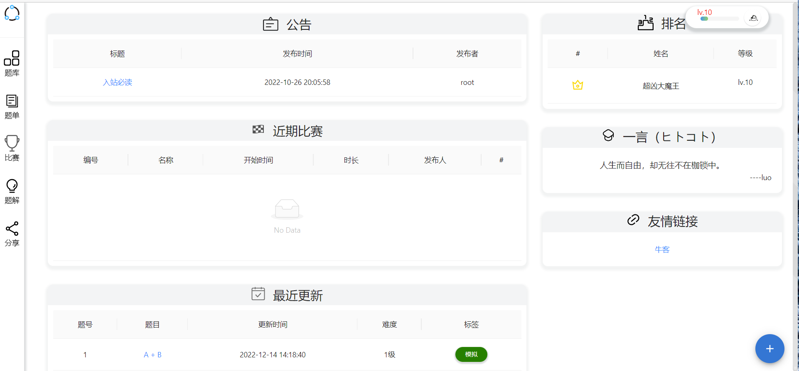
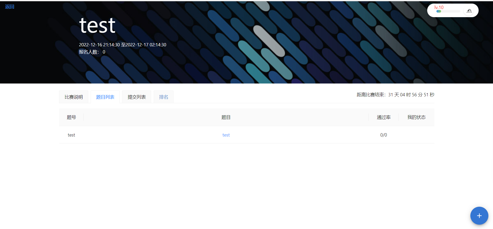
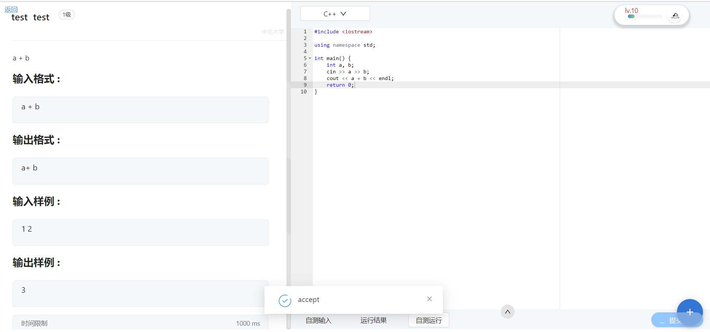
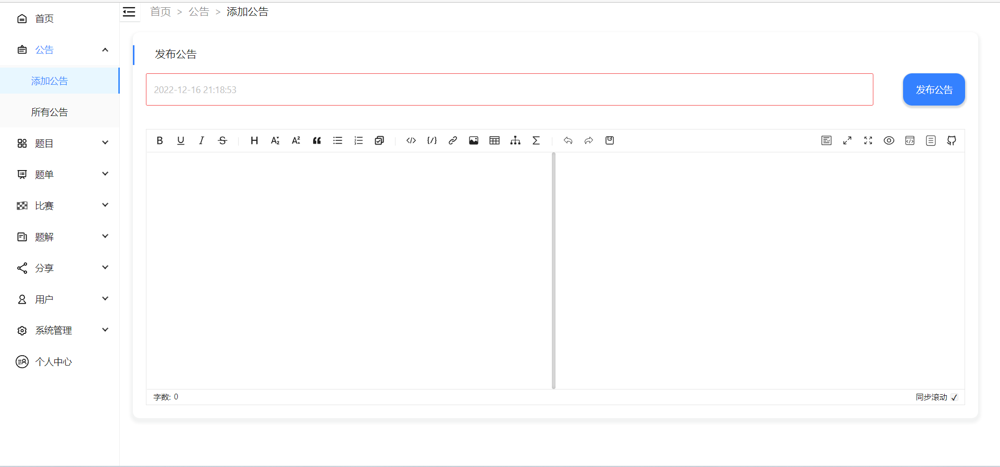
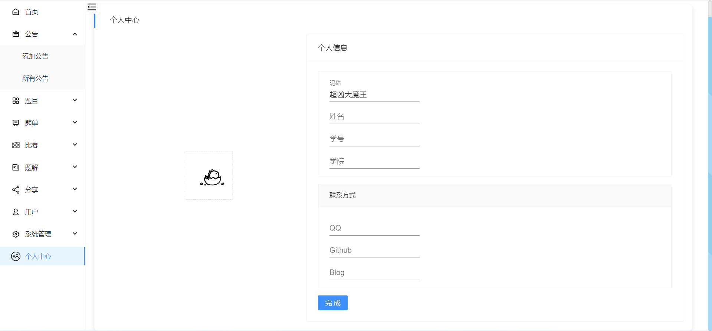

   基于Springboot + React 开发的前后端分离分布式在线评测平台

   

### 在线地址

**项目链接**：[https://www.snak.space/](https://www.snak.space/)

**后台地址**：[https://www.admin.snak.space/](https://www.admin.snak.space/)
**测试账号**： 账号: test@qq.com, 密码: Aa1234567。
**Github地址**：[https://github.com/3072844942/nucoj](https://github.com/3072844942/nucoj)
**在线接口地址**: [https://www.snak.space/api/doc.html](https://www.snak.space/api/doc.html)

### 目录结构

+ react 
    + nucoj：前台
    + nucoj_admin：后台
+ spring
    + cloud：eureka注册中心
    + judge_core：判题核心
    + judge_server：判题服务器
    + nucoj_spring：主服务器

### 技术简介

**前端**：react + redux + react router + axios + antd + echarts

**后端**：SpringBoot + SpringCloud + nginx + docker + SpringSecurity + Swagger2 + Redis + RebbitMQ

### 开发环境

| 开发工具           | 说明             |
| ------------------ | ---------------- |
| IDEA               | Java开发工具IDE  |
| WebStorm           | React开发工具IDE |
| Windows PowerShell | 杂项             |

| 开发环境 | 版本    |
| -------- | ------- |
| Java     | 1.8     |
| MongoDB  | 4.4.17  |
| Redis    | 3.0.504 |
| RabbitMQ | 3.11.2  |

| 运行环境 | 说明                  |
| -------- | --------------------- |
| 服务器   | 腾讯云2核4G CentOS7.6 |

### 项目截图

### 快速开始

详情见每个项目的README.md文件

### 项目总结

做一个作者的新手入门项目， 作者认为其完成了一个OJ应当完成的任务， 项目所用的技术栈也覆盖较广。但是，难以成为替代一个成熟的， 能够被学校所使用的OJ项目。UI界面，权限管理， 对故障的应急处理均有不足， 做的不好的地方请见谅。